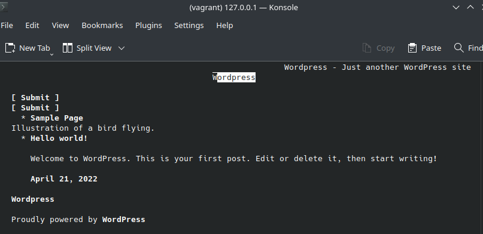

# Решение
После запуска vagrant, подключаемся к машине по ssh. Находим конфиг нашего сайта `/etc/nginx/conf.d/test.site.conf`.
Из этого конифига узнаем местонахождение исходных файлов и server_name сайта `test.site`.
Отмечаем низкое качество конфига и неправильный подход к конфигурации (конфиги всех сайтов должны находится в sites_available, включенные сайты - симлинками в sites_enabled). У нас дефолтный конфиг находится в `/etc/nginx/nginx.conf`, а конфиги сайтов подгружаются в дефолтном конфиге через директивы `include /etc/nginx/default.d/*.conf;`, это треш.
Далее пытаемся локально подключиться к `test.site`, не получается, скорее всего неправильно настроен сетевой интерфейс или dns.
В целях отладки просто убираем из дефолтного конфига заглушку centos, server_name для test.site меняем на localhost.
Wordpress скрипт 301 редиректом перенаправляет нас на `http://localhost:22080`, далее получаем ошибку.
Проверяем wp-config.php, там нет ничего про адреса портов, на первый взгляд криминала не видно, дополнительно проверяем логины и пароли для СУБД и т.д.
Ищем через google, где в конфигах WP находится адрес порта.
Не находим ничего подходящего для нашего случая, `grep -r 22080` тоже ничего не находит.

Спустя какое-то время приходит понимание, что скорее всего неправильный порт указан в настройках в СУБД, откуда его подгружает WP, поэтому grep и не нашел ничего.
Пытаемся жестко переопределить адрес сайта через wp-config:
```
define( 'WP_HOME', 'http://localhost' );
define( 'WP_SITEURL', 'http://localhost' );
```
Получается, сайт работает



# Текст задачи
Troubleshoot linux box.
You have to download vagrant box with broken wordpress and fix it whitout re-installing any software - only fix.
Vagrant box:
https://app.vagrantup.com/TimeS-Dev/boxes/centos7wpse