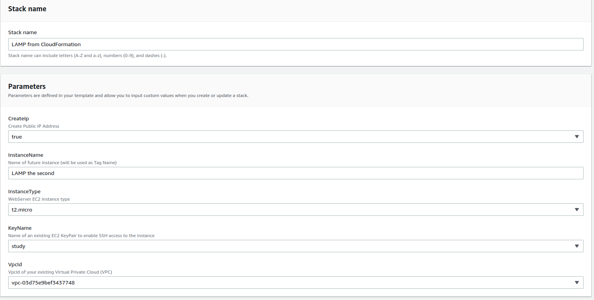

# Task 5.4 - Настройка сайта в AWS
Создаем t2.micro free tier instance в europe-central зоне через онлайн-интерфейс AWS, создаем ssh key pair через тот же интерфейс, в целях безопасности ssh трафик разрешаем только с одного ip (уже существующего личного lightsail на AWS), благодаря этому доступ по ssh будет доступен либо с той же самой виртуалки в lightsail (имитируем controlnode) или через туннель с физического ПК через wireguard. Также в теории мы увеличиваем быстродействие и экономим внешний трафик для EC2 благодаря передачи команд внутри сети, также мы не выдаем инстансу публичный ip адрес (с публичным ip у нас в будущем будет работать только балансировщик). Для выполнения пункта 2 прописываем playbook с ролями.
После создания инстанса пытаемся подключиться, выясняем, что lightsail изначально не имеет доступ к другим AWS ресурсам, читаем документацию и включаем галочку в Lightsail account. Подключаемся, но не можем обновить список пакетов, несмотря на разрешение в ACL и Subnet для исходящего траффика. Потратив почти час на чтение документации, используем встроенный Reachability Analyzer. В качестве единственного решения инструмент просит все же подключить внешний IP, создаем новый Elastic IPv4 и, надеюсь временно, прикрепляем его к инстансу. С разочарованием обнаруживаем, что в репозитории нет не то что стабильной LTS версии c security updates, майнтейнеры дистрибутивов могли бы и немного постараться. Идем в github и также расстраиваемся из-за того, что для скрипта NVM надо вручную прописывать версию и нет ссылки на latest. Создаем на инстансе нового пользователя, копируем ssh-key c controlnode. Пытыемся запустить playbook и понимаем, что в Amazon Linux нет симлинка на mysql-server, меняем на mariadb-server.

Создаем шаблон для Cloudformation, пытаемся развернуть. Вроде бы получается, удаляем первый созданный инстанс через визард.

# Задача
1. Задачи должны выполняться на Centos или Amazon Linux
2. Необходимо разобраться с установкой Apache + PHP 7.3 + MySQL + NPM, если получится - автоматизировать этот процесс (достаточно все оформить в bash, ansible)
3. Зарегистрировать бесплатную учетную запись в AWS
4. Разобраться со стоимостью сервисов в AWS и все дальнейшие действия делать только на бесплатном окружении!
5. Создать новый Инстанс, автоматически установить на нем софт из п.2, сохранить как AMI и удалить. 
6. Используя Cloudformation или Terraform:
    * Запустить инстанс, с предустановленным ПО из AMI из п.5. 
    * Создать Application load balancer, добавить маршрутизацию на сервер из п.5
    * Входные параметры Cloudformation/Terraform: 
        + Размер инстанса (выпадающий список)
        + SSH Ключ
        + Использование публичного IP адреса (true/false)
        + VPC, где будет размещен инстанс
        + Имя инстанса, которое будет задано как тег Name.
    * Выходные параметры:
        + Публичный IP инстанса
        + DNS, полученный в Load Balancer
7. На сервере сделать два сайта, через виртуальную директорию (site.loc/app1/ и site.loc/app2/), или через хосты (site1.loc и site2.loc) - на усмотрение).
    - 1й сайт: установить самый Wordpress без дополнительной конфигурации
    - 2й сайт: установить статический сайт https://github.com/gatsbyjs/gatsby-starter-hello-world
> Оба сайта должны работать через балансировщик
## В качестве успешно выполненного задания необходимо показать:
1. Скрипт по конфигурированию сервере (установке необходимого софта из п.2) – bash или playbook
2. Шаблон Cloudformation/Terraform для разворачивания окружения
3. Сайт на WP
4. Сайт на gatsby